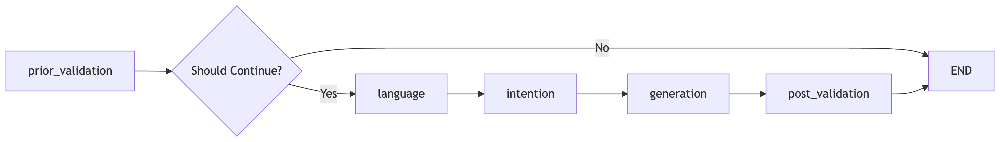

# Project Overview

This project is an intelligent chatbot focused on answering questions related to bank service fees. Its main features are as follows:

1. **Business Focus & Challenges**: The bot is designed for scenarios requiring high accuracy, such as bank fee inquiries. To ensure authoritative and precise responses, the system uses two types of LLMs: it first tries a high-precision LLM integrated with a structured Knowledge Graph; if coverage is insufficient, it falls back to a retrieval-based LLM, improving both accuracy and coverage.

2. **Safety Guardrails**: To prevent inappropriate outputs, the system integrates safety checks before and after conversations, including toxicity and refusal detection, ensuring both user input and bot responses comply with safety and regulatory requirements.

3. **Multi-dimensional Evaluation**: The project evaluates the model using test questions covering four different intentions, assessing toxicity, refusal, and hallucination probabilities in responses, providing a comprehensive measure of model quality and practical value.

The overall structure is as follows:

## 1. Entry File: main.py

`main.py` is the entry point of the project. In `main.py`, the `create_agent_graph()` method from `agent_graph.py` is called to build the Agent Graph for the entire Q&A process, which is then used to process and respond to user input.

## 2. Chatbot Q&A Workflow

### 2.1 Code Structure
In `agent_graph.py`, the core workflow of the chatbot is defined. The process is divided into the following steps, each represented by an Agent node:

- **(1) Pre-conversation Validation & Safety Filtering (prior_validation)**  
  Checks if user input contains harmful, offensive, or inappropriate content (e.g., toxicity detection). If the check fails, service is refused.

- **(2) Language Detection (language)**  
  Automatically detects the language of user input (supports Simplified Chinese, Traditional Chinese, English, etc.).

- **(3) Intention Recognition (intention)**  
  Determines the type of user question (e.g., rate query, comparison, eligibility, process inquiry, etc.).

- **(4) Response Generation (generation)**  
  Based on intention and language, calls different LLMs to generate a reply.

- **(5) Post-conversation Validation & Safety Filtering (post_validation)**  
  Performs another round of safety and compliance checks (e.g., toxicity and refusal detection) on the generated response to ensure it is safe and compliant.

### 2.2 Safety Guardrail Design

1. **Toxicity Detection**  
   The system integrates Hugging Face's toxigen_hatebert model to identify harmful, offensive, or inappropriate content in both user input and bot responses. The model is more sensitive to English and less effective for Chinese, but overall can intercept most non-compliant content. Toxicity detection is performed both before and after the conversation to ensure input and output safety.

2. **Refusal Detection**  
   Refusal detection determines whether the bot's response is a "refusal to answer" or "unable to help" type of content. The project uses whylogs + langkit's sentiment detection capabilities to analyze responses, promptly identifying and marking refusal scenarios for subsequent statistics and optimization.

3. **Data Leakage Detection**  
   Data leakage detection aims to prevent the bot from outputting sensitive or private information. There is currently no high-quality open-source model for this. After research, Hugging Face's `span-marker-bert-tiny-fewnerd-coarse-super` can be used for entity recognition, but its label set is limited and does not meet the strict data security requirements of the banking industry. For future deployment, it is recommended to fine-tune a model specifically for banking scenarios to improve detection accuracy and coverage.

### 2.3 Intention Recognition

1. **Rate Query**  
   Directly asks about the specific fee or charge for a banking service.  
   Example: "What are the charges for X service?" / "What are the charges for bulk cheque deposits over 30 pieces per day?"

2. **Comparison**  
   Compares fees, benefits, or policy differences between different accounts, services, or customer groups.  
   Example: "Which is better, Y or Z?" / "How do bulk cheque deposit fees differ for Senior Citizen Card holders vs. regular accounts?"

3. **Eligibility**  
   Checks if the user qualifies for fee waivers, discounts, or privileges.  
   Example: "Do I qualify for a fee waiver?" / "Are fee waivers available for Senior Citizen Card holders?"

4. **Process Inquiry**  
   Asks about the specific process for handling a business, applying for a fee waiver, etc.  
   Example: "How can I apply for a paper statement fee waiver?" / "How can a senior citizen apply for a paper statement fee waiver?"

5. **Test/Other**  
   Includes test cases or questions that do not fit into the above four categories.

**Suggestions for Future Optimization:**

- It is recommended to replace the intention recognition module with BERT or a similar lightweight model, and fine-tune it for banking scenarios to significantly improve classification accuracy and robustness.

### 2.4 Response Generation
1. **High-Precision Model**

1.1 Uses a Knowledge Graph approach, organizing document content into a network of nodes and edges. Node types include: cards, service, fee_rule, and footnote. Each node contains a text description and is connected via fee relationships from the document. (Due to the large amount of data cleaning required, the current code only processes the first page of rate queries.)

- eg. From cards to service

- eg. From service to fee_rule

- eg. From fee_rule to footnote

1.2 During queries, relevant nodes are automatically retrieved and analyzed together, ensuring the query is strictly limited to the provided document scope and comprehensively covers all related information, avoiding omissions.

1.3 The network structure is fully controlled by the user, avoiding the uncontrollable risks of algorithmic black boxes, and allowing flexible connections between different business content as needed. For example:
- Example 1: To recommend fund investment services for the Prestige Banking Card, the card node can be connected to the fund service node via a Recommend relationship.
- Example 2: Each person can be represented as a Person node, containing all descriptive information about that person. These descriptions can be used to connect to business nodes to be recommended, and to control which businesses should not be recommended (e.g., for people over 65, high-risk products are not recommended due to compliance, so no such connection is made).

1.4 In terms of implementation, `create_knowledge_graph.py` is used to build the graph, with data stored on a Neo4j cloud server and queried via the Neo4j API and Cypher syntax. This network structure is more complex than typical structured data, and its performance at large scale remains to be further studied.

2. **General Model**

2.1 No structured organization is performed; the original document text is directly extracted, split, tokenized, and stored in ChromaDB. (Currently, only the first page of rate queries is processed, for comparison with the high-precision model.)

2.2 During queries, a map-reduce retrieval method is used to aggregate results and generate the final answer.

2.3 Although this method is less accurate than structured data, it is more suitable for general comparison questions and can serve as a fallback when the Knowledge Graph does not provide coverage.

3. **Comparison of the Two Methods**

Example:

  <ul style="list-style: none; padding-left: 0;">
    <li>
      Question:
       
      <code style="color:rgb(60,58,58);">How can I get waived from Coin Changing Charges?</code>
    </li>
    <li style="margin-top: 10px;">
      Response (High-Precision Model):
      

        To get waived from Coin Changing Charges, you can enjoy a privileged service charge of HK$1 per sachet if you have an Integrated Account of Prestige Private or Prestige Banking.
      

    </li>
    <li style="margin-top: 10px;">
      Response (General Model):
      

        Based on the provided information, Coin Changing Charges can be waived under the following conditions:
        <ol style="margin: 6px 0 0 18px;">
          <li>If all cheques are deposited into the same account as one single transaction.</li>
          <li>For Customers with a Senior Citizen Card or Customers aged 65 or above.</li>
          <li>For Bulk Coins Deposit: If you deposit up to 500 coins per customer per day, the charge is waived.</li>
        </ol>
      

    </li>
    <li style="margin-top: 10px;">
      Correct Answer:
      

        Coin Changing Charges are HK$2 per sachet. Integrated Account of Prestige Private/Prestige Banking can enjoy a privileged service charge of HK$1 per sachet.
      

    </li>
  </ul>

As shown, the general model (i.e., standard text RAG) incorrectly responded with other fee information due to similarity-based retrieval.

## 3. Model Evaluation
### 3.1 Test Question Set Design

- The test set covers four typical intention types (see `./data/questions.yaml`):
  - Rate Query
  - Comparison
  - Eligibility
  - Process Inquiry

### 3.2 Automated Evaluation Metrics

Using the Test Question Set, one can calculate the accuracy% of the metrics below:

- **Toxicity Detection**: Calls `validator_toxicity.py`
- **Refusal Detection**: Calls `validator_refusal.py`
- **Data Leakage Detection**: Calls `validator_data_leakage.py`
- **Hallucination Detection**: Calls `validator_halluciation.py`

## 4. Future Improvement

1. **Speed**
   - **LLM Inference**: Currently, LLMs are called via remote APIs. Local deployment would significantly improve response speed. For simple classification tasks (e.g., intention recognition), lightweight models like BERT can replace large LLMs (e.g., Qwen) for faster inference.
   - **Knowledge Graph Inference**: Currently accessed via Neo4j remote API; migrating to local deployment would greatly improve inference speed.
   - **Vector Database Optimization**: ChromaDB is currently used for document vectors. Since rate data changes infrequently, more efficient vector databases like FAISS can be used to optimize retrieval speed.
   - **Fine-tuning Acceleration**: No model fine-tuning has been performed yet. In the future, tools like DeepSpeed can be used to accelerate the fine-tuning process.

2. **Accuracy**
   - **Model Fine-tuning**: Intention recognition and Toxgen models should be fine-tuned for the business scenario to improve Chinese understanding and classification accuracy.
   - **Financial Sensitive Word Detection**: In addition to general safety filtering, financial domain sensitive word detection (e.g., "guaranteed 20% return") should be added to meet compliance requirements.
   - **Real-time Monitoring**: It is recommended to use LangSmith to monitor response speed and anomalies at each stage, and Whylogs to monitor model output drift and active gardians (refer to validator_active.py), ensuring system stability and output quality.

3. **Scalability & Maintenance**
   - **Knowledge Graph Scalability**: The performance of the knowledge graph with large-scale data needs to be verified to ensure efficiency after expansion. I personally donnot think maintaning a huge network is a good idea, as network is far more complex than ordinary data structures, such as table, json etc. However, In our scenatios, where rates inquiry network is relatively small and precision is valued, it is suggested to use.
   - **Version Compatibility & Environment Maintenance**: LLMs and Agent tools are updated rapidly, so attention must be paid to version compatibility. After system launch, the old environment and syntax should be maintained to ensure continuous availability and maintainability.